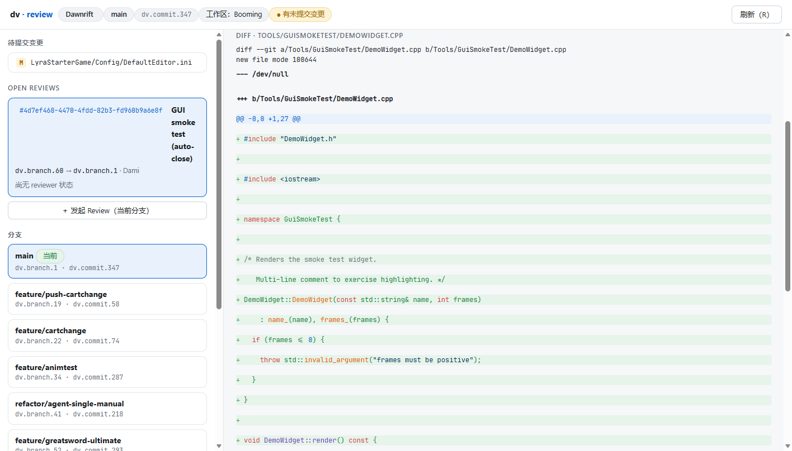
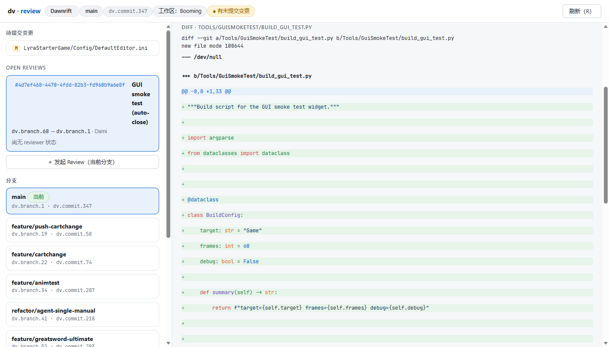

# dv-review-gui

一个独立的本地浏览器 GUI，给 [Diversion](https://diversion.dev)（`dv`）版本控制提供**人类直用的审查界面**：
工作区状态、待提交变更、提交历史、分支，以及完整的 review 流程 —— 发起 / 评论 / 批准 / 请求修改 / 拒绝 / 合并 / 关闭，
diff 带多语言语法高亮（C++/Python/INI/JSON/TS…）。

A standalone local web GUI for the Diversion version control system, built for human code review.
Zero runtime dependencies (Node ≥ 18 + the `dv` CLI).





## 功能

- **状态一览**：仓库 / 分支 / commit / 工作区 / 同步状态，结构化渲染（不是 CLI 文本墙）
- **待提交变更**：A/M/D/R 徽章 + 路径，点击看单文件 diff
- **Review 全流程**：发起（当前分支或任意分支对）、变更文件列表、逐文件 / 完整 diff（语法高亮）、行内与整篇评论、批准 / 请求修改 / 拒绝、合并、关闭
- **键盘**：`R` 刷新
- **安全**：服务只绑定 `127.0.0.1`，API token 不离开本地进程

## 快速开始

```bash
npm install && npm run build
DV_API_TOKEN=dvk_xxx npm start          # 默认 127.0.0.1:7391，自动打开浏览器
dv-review-gui D:/path/to/workspace      # 或显式指定工作区目录
```

- 需要 [Diversion CLI](https://docs.diversion.dev/quickstart)（`dv`）在 PATH 上，且已 `dv login`；
  headless 环境用 `dv authenticate <token>`。
- Review 的读/写走 [Diversion REST API](https://docs.diversion.dev/api-reference/introduction)，需要
  个人 API token（网页 → Settings → Integrations → Generate）：`DV_API_TOKEN=dvk_...`。
  （注意：API 文档标注需 Pro 档以上。）

### 环境变量

| 变量 | 作用 |
| --- | --- |
| `DV_API_TOKEN` | Diversion API token（review 功能必需） |
| `DV_WORKSPACE_DIR` | 默认工作区目录（也可用命令行第一个参数） |
| `DV_UI_PORT` | 服务端口（默认 7391） |
| `DV_UI_NO_OPEN` | 设为 `1` 则不自动打开浏览器 |
| `DV_BIN` | `dv` 可执行文件路径（默认 PATH 上的 `dv`） |

## 配合 Zed 使用

Zed 的拓展 API 没有 UI 面板接口，所以本工具以本地服务 + 浏览器的形态接入：
把下面这段加进 Zed 全局 `tasks.json`，再用 `keymap.json` 绑一个键（如 `alt-d`）：

```jsonc
{
  "label": "dv: review GUI",
  "command": "node D:/dv-review-gui/dist/server.js",
  "cwd": "$ZED_WORKTREE_ROOT",
  "env": { "DV_API_TOKEN": "dvk_..." },
  "reveal": "always",
  "allow_concurrent_runs": true
}
```

按下快捷键即可从当前项目一键呼出审查界面（Windows 下自动用 Edge 打开新窗口）。

## 已知限制

- 二进制资产较多的分支之间做**内容级**全量 diff 可能需要几分钟（`dv diff` 本身的开销）；
  界面默认只展示文件列表，内容 diff 按需加载。
- Review 的"发起"走 `dv review`（针对当前分支）；任意分支对可以用 `DV_API_TOKEN` 直接调 API。

## License

[MIT](LICENSE)
